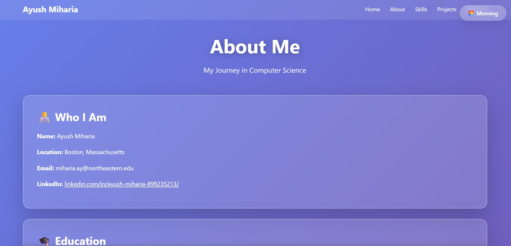

# Ayush Miharia - Personal Homepage

A modern, responsive personal portfolio website showcasing my journey as a graduate student and software developer. Built with vanilla HTML, CSS, and JavaScript featuring a time-based dynamic theme system and interactive flip cards.

## Live Demo

🔗 [View Live Demo](https://ayushmiharia.github.io/Project-1-WebDev/)


## Project Objective

This project serves as my personal homepage and portfolio to:

- Showcase my work experience, projects, and technical skills
- Provide a central hub for professional connections (GitHub, LinkedIn, Email)
- Express my personality through design choices and interactive elements
- Demonstrate frontend development capabilities with pure HTML/CSS/JS

## Features

- **Time-Based Theme System** - Automatically changes colors based on time of day (Morning/Afternoon/Evening/Night)
- **Interactive Flip Cards** - Hover to reveal detailed information with smooth 3D CSS transforms
- **Scroll Animations** - Fade-in effects using Intersection Observer API
- **Glassmorphism Design** - Modern backdrop blur effects and gradient backgrounds
- **Multiple Pages** - Dedicated pages for About, Skills, Projects, and Interests
- **Fully Responsive** - Works on desktop, tablet, and mobile devices
- **ES6 Modules** - Clean, organized JavaScript code structure

## Screenshots

| Home Page | About Page |
|-----------|------------|
|  |  |

## Tech Stack

- **HTML5** - Semantic markup structure
- **CSS3** - Custom styling with CSS Grid, Flexbox, animations, 3D transforms
- **JavaScript (ES6+)** - DOM manipulation, Intersection Observer API, ES6 modules
- **No external libraries** - Pure vanilla implementation (no jQuery, no frameworks)

## Project Structure
```
personal/
├── homepage.html               # Main homepage
├── package.json                # Project configuration
├── .eslintrc.json              # ESLint configuration
├── README.md                   # Project documentation
├── Design_document.pdf         # Design documentation
├── images/
│   └── thumbnail.png           # Screenshot/thumbnail
├── css/
│   └── styles.css              # All styling
├── js/
│   └── main.js                 # ES6 module with all functionality
└── pages/
    ├── about.html              # About me page
    ├── skills.html             # Technical skills page
    ├── projects.html           # Projects showcase
    └── interests.html          # Personal interests page
```

## Design Document

View the design document for this project: [Personal_Home_page.pdf](Personal_Home_page.pdf)

## How to Install / Use

### Option 1: Clone and Open
```bash
# Clone the repository
git clone https://github.com/ayushmiharia/personal.git

# Navigate to the project directory
cd personal

# Open in browser
open homepage.html
# or simply double-click homepage.html
```

### Option 2: Live Server (Recommended for Development)
```bash
# If you have VS Code with Live Server extension
# Right-click homepage.html -> Open with Live Server

# Or using Python
python -m http.server 8000
```

## Creative Feature: Time-Based Theme System

The website automatically detects the current time and applies a matching theme:

| Time | Theme | Colors |
|------|-------|--------|
| 5 AM - 12 PM | 🌅 Morning | Purple gradient |
| 12 PM - 5 PM | ☀️ Afternoon | Pink gradient |
| 5 PM - 8 PM | 🌆 Evening | Blue gradient |
| 8 PM - 5 AM | 🌙 Night | Dark gradient |

## Author

**Ayush Miharia**  
Graduate Student @ Northeastern University | Software Developer & Data Analyst

- 🌐 Homepage: [ayushmiharia.github.io/personal](https://ayushmiharia.github.io/personal)
- 🐙 GitHub: [github.com/ayushmiharia](https://github.com/ayushmiharia)
- 📧 Email: [miharia.ay@northeastern.edu](mailto:miharia.ay@northeastern.edu)

## 📚 Class Reference

This project was created as part of **CS 5610 - Web Development** at Northeastern University.

Course Link: [CS 5610 Web Development](https://johnguerra.co/classes/webDevelopment_fall_2024/)

## Video Demonstration

[Watch the demo video]

## GenAI Tools Usage

This project utilized AI assistance in the following ways:

| Tool | Version | Usage |
|------|---------|-------|
| Gemini | Gemini 3.0 | time- based theme page (about) and code structure suggestions |

**Prompts Used:**
- "Design a time-based theme system for a portfolio"
- "Teach me how the time-based theme work" 

**How AI Assisted:**
- Helped structure the time-based theme JavaScript logic and about.html page

## License

This project is open source and available under the [MIT License](LICENSE).

---
