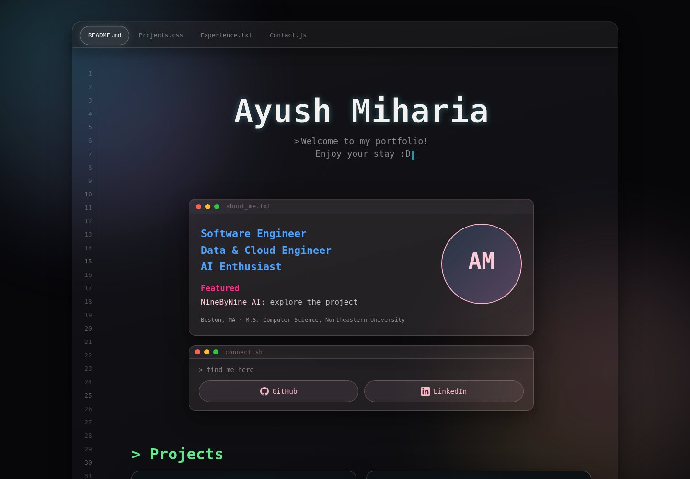
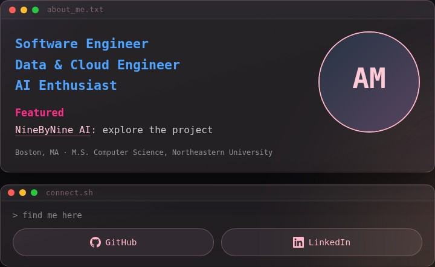

# Ayush Miharia — Portfolio

A single-page portfolio built with HTML, CSS, and vanilla JavaScript. The terminal/editor design follows [Salwa Shuman's portfolio](https://salwashuman.com/), adapted for Ayush's projects and experience.

## Portfolio previews

| Homepage | About section |
| --- | --- |
|  |  |

[View the mobile preview](images/portfolio-mobile.jpg)

## Sections

- Introduction, initials avatar, GitHub, and LinkedIn
- Five project cards based on the current résumé
- Brillio experience, education, and technical skills
- Contact panel that opens a prepared message in the visitor's email application

The project thumbnails are original illustrative SVGs, rather than application screenshots. Replace them with screenshots when available. Project demo/repository links can be added once their URLs are confirmed.

## Preview locally

From the repository root:

```sh
python3 -m http.server 8000
```

Open `http://localhost:8000`. No build step or npm dependencies are required.

## Edit content

- `index.html`: text, navigation, contact email, and links
- `css/styles.css`: theme, glass panels, responsive layouts, and reduced-motion styles
- `js/main.js`: typing, line numbers, active tabs, hover highlights, and email composition
- `assets/`: initials avatar and project illustrations

Legacy URLs in `pages/` redirect to the corresponding sections. Relative asset paths support GitHub Pages hosting under `/Project-1-WebDev/`.

## Contact behavior

The contact form validates its fields and opens a `mailto:` draft. The visitor sends the message in their email app. It does not automatically send messages or report delivery. A direct email link is also available.

## Publishing

Merge the redesign into the repository's configured GitHub Pages source branch after reviewing it. The existing public site URL is https://ayushmiharia.github.io/Project-1-WebDev/.

The portfolio uses an initials avatar and does not include a personal portrait or résumé PDF.
